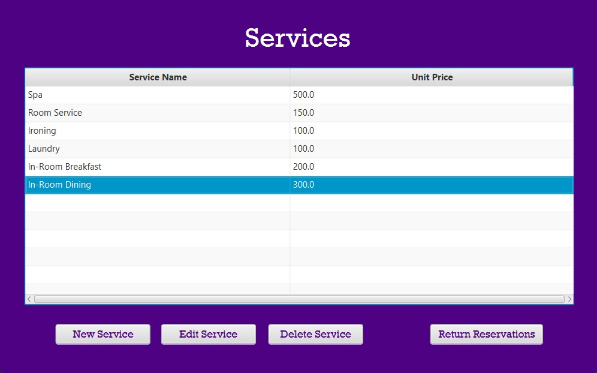

# Hotel Reservation Management System

## Overview

This Java-based Hotel Reservation Management System simulates a management system
for hotel reservations and room management. It allows the administrator to create
rooms with both common and unique features, manage customer reservations, and handle
check-in/check-out processes.

## Features

- **Room Creation:** The system enables the creation of rooms specifying their capacity, 
price and unique features (e.g., sea view, jacuzzi).
- **Feature Management:** Specialized features can be added to rooms during their creation.
- **Service Customization:** Users can select services (e.g., room service, spa, laundry)
and specify quantities during reservation creation.
- **Modify Reservation Services:** The system allows modification of selected services and 
quantities for a reservation after its creation.
- **Customer Reservation:** Customers can be created and make reservations for available 
rooms and select desired services, specifying check-in and check-out dates.
- **Check-in/Check-out:** The system facilitates the check-in and check-out processes, 
recording entry and exit times for customers.

## Sample Interface

- *You can view, edit, and delete reservations conveniently. Additionally, the panel includes 
buttons directing to other panels like Rooms and Customers.*

- *You can select desired services and specify check-in/check-out dates for a new reservation.*

- *You can display, edit, and delete services and their respective unit prices.*

- *You can utilize this panel to easily generate new customer profiles.*

## Note

This project is a simplified simulation. To deploy it for a real hotel environment, further
functionalities like database integration, user interfaces, and more extensive error handling
would be necessary.